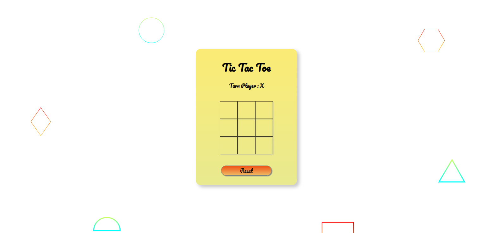

<h1 align="center">Tic Tac Toe Game</h1>

Tic-tac-toe, or noughts and crosses, or Xs and Os is a game for two players who take turns marking the spaces in a three-by-three grid with X or O. The player who succeeds in placing three of their marks in a horizontal, vertical, or diagonal row is the winner. It is a solved game, with a forced draw assuming best play from both players.

<h2></h2>

<a href="https://mre-dev.github.io/tic-tac-toe-game/">----- Click To View Demo -----</a>

<h2></h2>

Screenshot : 

